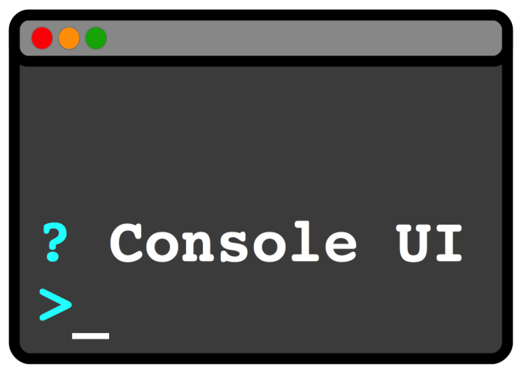

# ConsoleUI (DEPRECATED)

> **⚠️ DEPRECATED**: This module is deprecated. Please use `jline-prompt` instead, which provides a cleaner, interface-based API.

Tiny java library that provides simple UI elements on ANSI console based terminals. ConsoleUI is inspired by
[Inquirer.js](https://github.com/SBoudrias/Inquirer.js) which is written in JavaScript.

ConsoleUI has been initially implemented using JLine2 by Andreas Wegmann. After ConsoleUI has been upgraded to use JLine3
it has been merged into JLine3.

# Intention

I was impressed by JavaScript based Yeoman which leads the user through the process of creating new projects
by querying with a simple user interface on the console. An investigation how this is done, brought
me to Inquirer.js which implements a very simple and intuitive set of controls for checkbox, list, and text input.

Because I didn't find anything comparable to this in the Java ecosystem, I decided to write `Console UI`
as a library with the same easy 'look and feel'. Some parts of the API are also comparable, but Console UI is not
a Java clone of Inquirer.js.

# Features

 Console UI currently supports:

 - Text input with completion and GNU ReadLine compatible editing
 - Checkboxes
 - Lists
 - Expandable Choices (multiple key based answers for a question with help and optional list navigation)
 - Yes/No-Questions

A screen recording of the basic elements demo can be fund on YouTube [console UI demo](https://youtu.be/6dB3CyOX9rU).

# Dependencies

Console UI uses JLine for the dirty console things.

# Maven artefact

ConsoleUI releases are available at Maven Central [org.jline » jline-console-ui](https://search.maven.org/artifact/org.jline/jline-console-ui)

# Test Run

You can get an idea how the project works by looking at `org.jline.prompt.examples.NewApiExample`.
You can run this by executing the following from the project root:

    ./jline-console-ui.sh

# Usage

For detailed documentation on how to use ConsoleUI, please visit the [JLine website](https://jline.org/docs/modules/console-ui).

## New API (org.jline.prompt)

The new API provides a cleaner interface-based approach. The entry point is the `ConsoleUI` interface, which can be created using the `ConsoleUIFactory`.

```java
// Create a ConsoleUI instance
Terminal terminal = TerminalBuilder.builder().build();
Prompter prompter = PrompterFactory.create(terminal);

// Create a prompt builder
PromptBuilder promptBuilder = prompter.getPromptBuilder();

// Add prompts
promptBuilder.createListPrompt()
    .name("choice")
    .message("Choose an option:")
    .newItem("option1")
    .text("Option 1")
    .add()
    .newItem("option2")
    .text("Option 2")
    .add()
    .addPrompt();

// Prompt the user
Map<String, PromptResult> result = prompter.prompt(header, promptBuilder.build());
```

## Migration to jline-prompt

This module is deprecated. Please migrate to the new `jline-prompt` module which provides:

- Clean interface-based design
- Better separation of concerns
- Record-style accessor methods
- Improved type safety
- Better documentation

To migrate:
1. Replace dependency `jline-console-ui` with `jline-prompt`
2. Replace imports from `org.jline.consoleui` with `org.jline.prompt`
3. Use the new API as shown in the `jline-prompt` documentation

## Legacy API (org.jline.consoleui.prompt)

The legacy API is still available for backward compatibility. Entry point to the builder classes is to create a new object of type `ConsolePrompt`.

    ConsolePrompt prompt = new ConsolePrompt();

From the prompt object, use the `getPromptBuilder()` method to create the builder for all subsequent UI elements
you want to use.

    PromptBuilder promptBuilder = prompt.getPromptBuilder();

From with this `PromptBuilder` you can access UI builder with the following methods:

- createCheckboxPrompt()
    * creates a checkbox prompt. This prompt lets the user choose any number of items from a list.
- createChoicePrompt()
    * creates a choice prompt. This prompt lets the user choose one from a given number of possible answers.
- createConfirmPromp()
    * creates a confirmation prompt. This prompt lets the user answer with 'yes' or 'no' to a question.
- createInputPrompt()
    * creates an input prompt. This prompt is a classic entry line like a shell with optional masking and completion.
- createListPrompt()
    * creates a list prompt. This prompt lets the user choose one item from a list.
