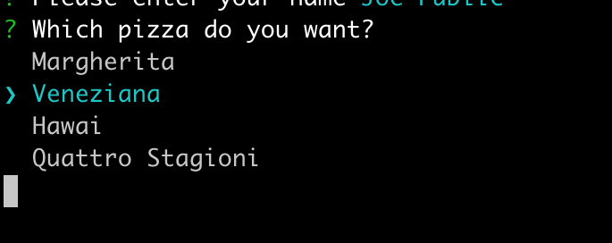
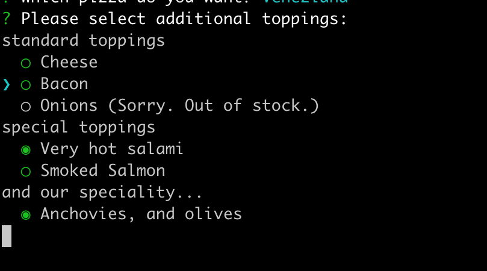
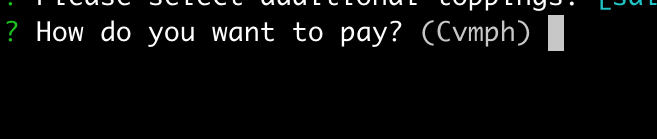
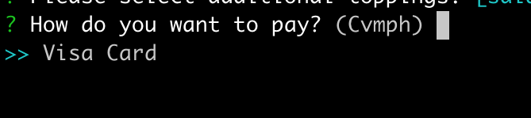
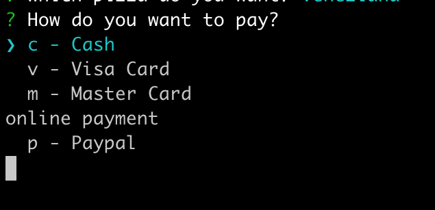

# ConsoleUI programming guide

This document contains a brief introduction in using ConsoleUI.

## Introduction

ConsoleUI is a library for prompting the user for different types of input. It provides simple UI elements on ANSI console based terminals. ConsoleUI is inspired by [Inquirer.js](https://github.com/SBoudrias/Inquirer.js) which is written in JavaScript.

## Features

Console UI currently supports:

- Text input with completion and GNU ReadLine compatible editing
- Checkboxes
- Lists
- Expandable Choices (multiple key based answers for a question with help and optional list navigation)
- Yes/No-Questions

## A small example

The following code presents a simple, but complete code example to use CosoleUI for a selecting an item from a list.

```java
package de.codeshelf.consoleui;

import de.codeshelf.consoleui.prompt.ConsolePrompt;
import de.codeshelf.consoleui.prompt.PromtResultItemIF;
import de.codeshelf.consoleui.prompt.builder.PromptBuilder;
import jline.TerminalFactory;
import org.fusesource.jansi.AnsiConsole;

import java.io.IOException;
import java.util.HashMap;

import static org.fusesource.jansi.Ansi.ansi;

/**
 * User: Andreas Wegmann
 * Date: 12.08.2020
 */
public class SimpleExample {

  public static void main(String[] args) throws InterruptedException {
    AnsiConsole.systemInstall();                                      // #1
    System.out.println(ansi().eraseScreen().render("Simple list example:"));  

    try {
      ConsolePrompt prompt = new ConsolePrompt();                     // #2
      PromptBuilder promptBuilder = prompt.getPromptBuilder();        // #3

      promptBuilder.createListPrompt()                                // #4
              .name("pizzatype")
              .message("Which pizza do you want?")
              .newItem().text("Margherita").add()  // without name (name defaults to text)
              .newItem("veneziana").text("Veneziana").add()
              .newItem("hawai").text("Hawai").add()
              .newItem("quattro").text("Quattro Stagioni").add()
              .addPrompt();                                         
      
      HashMap<String, ? extends PromtResultItemIF> result = prompt.prompt(promptBuilder.build()); // #5
      System.out.println("result = " + result);
    } catch (IOException e) {
      e.printStackTrace();
    } finally {
      try {
        TerminalFactory.get().restore();
      } catch (Exception e) {
        e.printStackTrace();
      }
    }
  }}

```

Basic steps:

1. ConsoleUI uses [jansi](https://github.com/fusesource/jansi), so you have to initialize it first
2.  Create a new `ConsolePrompt` object.
3. Create a `PromptBuilder`. All user interaction can be create with the prompt builder object.
4. In this example we create a `ListPrompt`
   1. give it a name ('pizzatype')
   2. assign a prompt message ("Which pizza do you want?")
   3. create items with and name (optinal) and a text and add them to the ListPrompt
   4. to finish call `addPrompt()` to create the ListPrompt and add it to the prompt builder object.
5. calling `prompt.prompt(promptBuilder.build())` builds all the promts (in this example only one) and enters the user interaction. After all prompts are processes, the `prompt()` method returns an object with the user input results.

# Prompting for user input

### Input

The InputPrompt is a classic entry line like a shell. Because of the underlying readline implementation it offers you to provide completers (like file name completer or string completer). In addition to his, you can define a mask character which is printed on the screen instead of the typed keys like used for hidden password entry.

```java
promptBuilder.createInputPrompt()                               // #1
  .name("name")                                                 // #2
  .message("Please enter your name")                            // #3
  .defaultValue("John Doe")                                     // #4
  //.mask('*')                                                  // #5
  .addCompleter(new StringsCompleter("Jim", "Jack", "John"))    // #6
  .addPrompt();
```

Description:

1. With the prompt builder call `createInputPrompt()` to create a new input prompt builder
2. Set a name for the prompt. Setting a name is neccessary to pick the right user input from the result object after the user interaction is finished. The resulting object is `HashMap` where each key is the name of a prompt you have created before.
3. Add a message which is printed in front of the user input.
4. (optional) By adding a default value, you offer the user just to press enter to accept the default value. The default value is printed in parentheses after the prompt. 
5. (optional) If you add a masking character, each key pressed by the user echoed as this mask character on the console. That's useful for password entries.
6. (optional) You can add completers (like simple string competers, file completers or more complex completers) to simplify the user input. The user can use the TAB button to complete partitial input. See [jline/jline2](https://github.com/jline/jline2/tree/master/src/main/java/jline/console/completer) for details and examples. 

#### Console


#### User Input

The user can use readline compatible navigation (mainly Emacs control codes) inside the user input area. This includes CTRL-a to go to the beginning of input, CTRL-e to go to the end, and so on. 

After the input, the entered value is printed in different color right after the prompt. 

#### Result

The result of this prompt is of type `InputResult` and has a method `getInput()` to the get user input.

### List 

The ListPrompt lets the user choose one item from a given list. If the list is bigger than the terminal height, the list partially shown and scrolled if needed.

```java
promptBuilder.createListPrompt()                                                // #1
  .name("pizzatype")                                                            // #2
  .message("Which pizza do you want?")                                          // #3
  .newItem().text("Margherita").add()  // without name (name defaults to text)     #4
  .newItem("veneziana").text("Veneziana").add()                                 // #5
  .newItem("hawai").text("Hawai").add()                                         
  .newItem("quattro").text("Quattro Stagioni").add()
  // .pageSize(10)                                                                 #6
  // .relativePageSize(66)																											   #7
  .addPrompt();
```

Description:

1. With the prompt builder call `createListPrompt()` to create a new list prompt builder.
2. Set a name for the prompt.
3. Add a message which is printed on top of list.
4. Add items to the list. If you call `newItem()` without a name for the item, the text of the item is used in the result.
5. Add items with `newItem(<item_name>)` to give the item a name which make it possible to use a technical key or an other value instead of the printed text as result.
6. (optional) For long lists, you can use `pageSize()` to set an absolute number of items to display (default is 10). Even if you choose a higher value than the terminal, the list will never exceed the terminal height. 
7. (optional) Further you can use `relativePageSize()` to set a percentual size of the terminal as height. In this example 66 is 66/100 or 2/3 of the terminal used for the list items. At least one line is display even when you select a very low value. 

#### Console



#### User input

The user can use up and down keys or VI like the keys `'j'` for down and `'k'` for moving the selector in front of the items to the right position. Pressing the enter button selects the item. 

After the input, the list is erased from the screen and the selected value is printed in different color right after the prompt.  

#### Result

The result of this prompt is of type `ListResult` and has a method `getSelectedId()` to the get user input.

### Checkbox

The checkox input lets the user choose any number of items of a given list. It's possible to add separators between items. Further it's possible to disable items and display a message text, why they are disabled. Sometimes this may be useful to present a consistent user interface with all usually displayed options and an explanation why some items are not usable here.

```java
promptBuilder.createCheckboxPrompt()                                            // #1
  .name("topping")                                                              // #2
  .message("Please select additional toppings:")                                // #3
  .newSeparator("standard toppings").add()                                      // #4
  .newItem().name("cheese").text("Cheese").add()                                // #5
  .newItem("bacon").text("Bacon").add()                                         // #6
  .newItem("onions").text("Onions").disabledText("Sorry. Out of stock.").add()  // #7
  .newSeparator().text("special toppings").add()                                
  .newItem("salami").text("Very hot salami").check().add()                      // #8
  .newItem("salmon").text("Smoked Salmon").add()
  .newSeparator("and our speciality...").add()
  .newItem("special").text("Anchovies, and olives").checked(true).add()         // #9
  // .pageSize(10)                                                                 #10
  // .relativePageSize(66)																											   #11
  .addPrompt();
```

Description:

1. With the prompt builder call `createCheckboxPrompt()` to create a new checkbox prompt builder.
2. Set a name for the prompt.
3. Add a message which is printed on top of list.
4. Use `newSeparator()` to add a separation element with a describing text.
5. Use `newItem()` like in the list promt to add selectable elements to the checkbox prompt.
6. The name can be set directly with `newItem(<name>)` instead of using the `name()` method.
7. With `disabledText()` the item is not selectable, the text is displayed after the item. *Note:* even when the item is disabled it can be checked by default.
8. Use the `check()` method to pre check the corresponding item.
9. For more flexibility you can use `checked()` with a boolean value to select if the item is checked by default.
10. (optional) For long lists, you can use `pageSize()` to set an absolute number of items to display (default is 10). Even if you choose a higher value than the terminal, the list will never exceed the terminal height. 
11. (optional) Further you can use `relativePageSize()` to set a percentual size of the terminal as height. In this example 66 is 66/100 or 2/3 of the terminal used for the list items. At least one line is display even when you select a very low value. 

#### Console



#### User input

The user can use up and down keys or VI like the keys `'j'` for down and `'k'` for moving the selector in front of the items to the right position. Toggeling selection on an item is done with the space bar. Pressing the enter button finished the input. 

After the input, the list is erased from the screen and the names of the selected values are printed in different color right after the prompt.  

#### Result

The result of this prompt is of type `CheckboxResult` and has a method `getSelectedIds()` to the get user input which is of type`HashSet<String>` containing the names of the selected items. 

### Expandable choice

The choice prompt lets the user choose one from a given number of possible answers. It is used for requesting input what would be done in a graphical user interface by a message box. It's usable for choices like "yes/no/cancel". Each entry is assigned with a single key stroke to provide a quick input by pressing that key. 

By default only the message and the possible keys are displayed which may make it difficult for new users to know what keystroke is associated with what answer. To get around this, a help mode is integrated. If the user pressed the 'h' button (for help), all possible answers with explanation are shown as a list where the user can choose from.

```java
promptBuilder.createChoicePrompt()                                          // #1
  .name("payment")                                                          // #2
  .message("How do you want to pay?")                                       // #3
  .newItem().name("cash").message("Cash").key('c').asDefault().add()        // #4
  .newItem("visa").message("Visa Card").key('v').add()                      // #5
  .newItem("master").message("Master Card").key('m').add()
  .newSeparator("online payment").add()                                     // #6
  .newItem("paypal").message("Paypal").key('p').add()
  .addPrompt();
```

Description:

1. With the prompt builder call `createChoicePrompt()` to create a new choice prompt builder.
2. Set a name for the prompt.
3. Add a message which is printed on the screen.
4. Create new items with name, message and associated key. One of the items can be a default.
5. Create other non default items.
6. Use `newSeparator()` to add a separation element with a describing text.

#### Console and user input

By default, the message is displayed and a list of all short keys for selection. The defaults value key is printed in upper case to indicate the default value. The letter 'h' is added to the list by default to activate the more detailed helpful list view.



If the user presses one of the choice keys, the corresponding message is displayed and can be confirmed with the enter key.



If the user presses the 'h' key, the long list is displayed.



The detailed navigation is usable like the list prompt by pressing up and down arrow keys and selecting a value with the enter key.

#### Result

The result of this prompt is of type `ExpandableChoiceResult` and has a method `getSelectedId()` to the get user input.

### Confirmation

The confirmation prompt lets the user answer with 'yes' or 'no' to a given question. This is the minimalistic version of the choice prompt.

```java
promptBuilder.createConfirmPromp()                       // #1
  .name("delivery")                                      // #2
  .message("Is this pizza for delivery?")                // #3
  .defaultValue(ConfirmChoice.ConfirmationValue.YES)     // #4
  .addPrompt();
```

Description:

1. With the prompt builder call `createChonfirmPrompt()` to create a new confirmation prompt builder.
2. Set a name for the prompt.
3. Add a message which is printed as prompt.
4. With `defaultValue()` you can set either 'yes' or 'no' as a default.

#### Console


#### User input

By pressing 'y' or 'n' (or 'j/n' in the german localization) the user can select beween 'yes' and 'no' as answer. By pressing the enter key the user confirms the input.

#### Result

The result of this prompt is of type `ConfirmResult` and has a method `getConfirmed()` to the get user input of type `ConfirmChoice.ConfirmationValue` which is an enum of either 'YES' or 'NO'.

